# 基于 VirtualBox 的网络攻防基础环境搭建

## 实验目的

- 掌握 VirtualBox 虚拟机的安装与使用；
- 掌握 VirtualBox 的虚拟网络类型和按需配置；
- 掌握 VirtualBox 的虚拟硬盘多重加载；

## 实验环境

- Parallels Desktop 虚拟机
- 攻击者主机（Attacker）：`kali-linux-2020.3-installer-amd64.iso`
- 网关（Gateway, GW）：`ubuntu-18.04.4-server-amd64`
- 靶机（Victim）：`kali-linux-2020.3-installer-amd64.iso`

## 实验要求

- 虚拟硬盘配置成多重加载；
- 搭建满足如下拓扑图所示的虚拟机网络拓扑；


> 根据实验宿主机的性能条件，可以适度精简靶机数量

- 完成以下网络连通性测试；
  - [x] 靶机(victim)可以直接访问攻击者(attacker)主机
  - [x] 攻击者(attacker)主机无法直接访问靶机(victim)
  - [x] 网关(gateway)可以直接访问攻击者(attacker)主机和靶机(victim)
  - [x] 靶机(victim)的所有对外上下行流量必须经过网关(gateway)
  - [x]  所有节点均可以访问互联网

## 实验过程

##### 配置多重加载

1. 在[virtualbox官网](https://www.virtualbox.org/wiki/Downloads)下载相应版本的**Extension Pack**
2. 安装好所需要的相关系统


3. 在工具-介质中找到相应的vdi文件，设置类型为**多重加载**

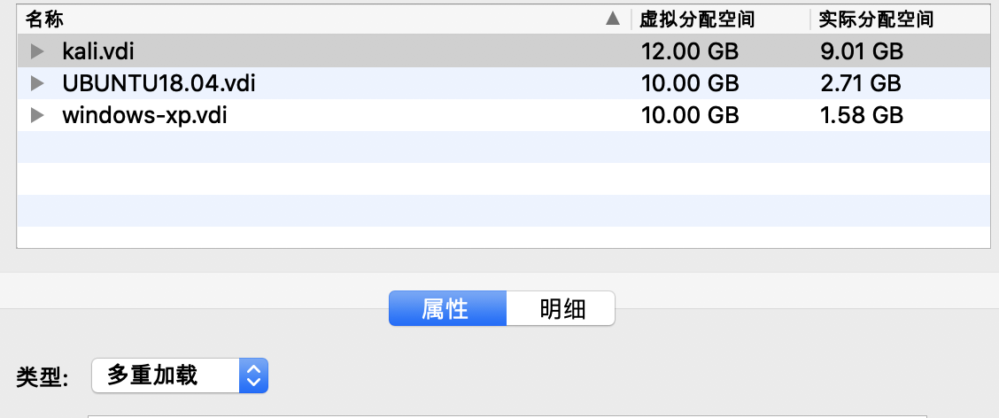

##### 安装主机

1. 选择设置的vdi文件创建新的虚拟机

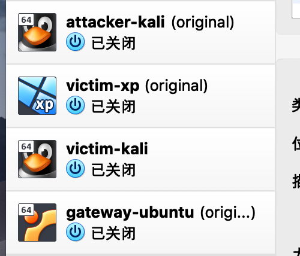

2. 攻击者、靶机、网关在安装完毕后都以**root**身份执行`apt update && apt upgrade -y `
3. victim-xp关闭防火墙

##### 配置网络

网卡设置如图

- gateway

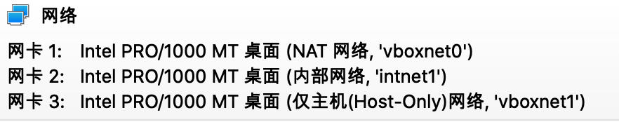

- victim


- attacker


| 虚拟机               | 网卡-IP地址                                                  |
| -------------------- | ------------------------------------------------------------ |
| gateway：ubuntu18.04 | NAT网络10.0.2.4    内部网络172.16.111.4    host-only网络192.168.57.1 |
| victim：Windows xp   | 内部网络172.16.111.101                                       |
| attacker：kali       | NAT网络10.0.2.15                                             |
网络拓扑图
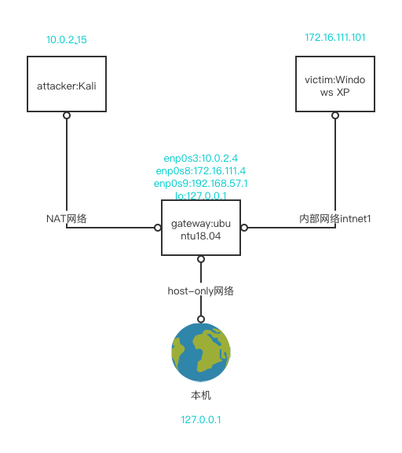

##### 修改interfaces配置文件

```conf
# /etc/network/interfaces
# This file describes the network interfaces available on your system
# and how to activate them. For more information, see interfaces(5).

source /etc/network/interfaces.d/*

# The loopback network interface
auto lo
iface lo inet loopback

# The primary network interface
allow-hotplug enp0s3
iface enp0s3 inet dhcp
  post-up iptables -t nat -A POSTROUTING -s 172.16.111.0/24 ! -d 172.16.0.0/16 -o enp0s3 -j MASQUERADE
  
allow-hotplug enp0s8
  iface enp0s8 inet static
  address 172.16.111.1
  netmask 255.255.255.0  
allow-hotplug enp0s9
iface enp0s9 inet dhcp
```

重启网络使配置生效`systemctl restart networking`

查看gateway的网卡配置情况

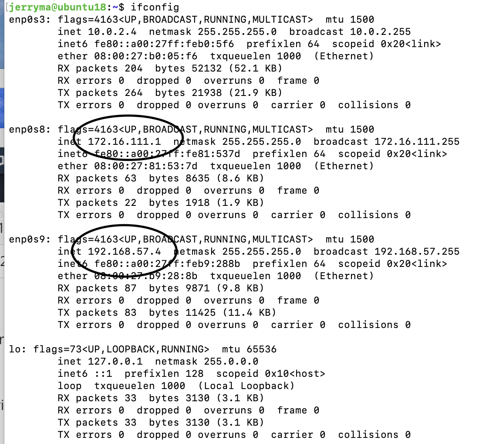

> 其中enp0s3为NAT网络，enp0s8为内部网络，enp0s9为host-only网络

##### 安装并配置dnsmasq

- 安装dnsmasq`apt update&&apt install dnsmasq`

- 停止dnsmasq服务`/etc/init.d/dnsmasq stop`
- 在`/etc/dnsmasq.d`下新建一个文件名为`gw-enp08.conf`的文件

```conf
# /etc/dnsmasq.d/gw-enp08.conf
interface=enp0s8
dhcp-range=172.16.111.100,172.16.111.150,240h
```

- 备份配置文件`cp dnsmasq.conf dnsmasq.conf.bak`
- 修改配置文件

```conf
# /etc/dnsmasq.conf
#删除log-queries前的注释
#添加log-facility=/var/log/dnsmasq.log
#删除log-dhcp前的注释
```

- 重启dnsmasq服务`systemctl restart dnsmasq`
- 设置为开机自启动`systemctl enable dnsmasq`

##### 连通性测试

1. 靶机(victim)可以直接访问攻击者(attacker)主机

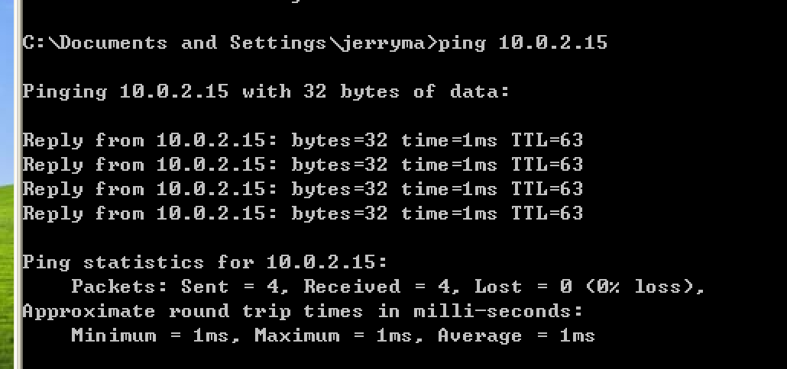

2. 攻击者(attacker)主机无法直接访问靶机(victim)

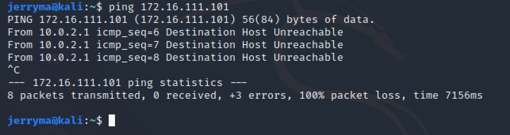

3. 网关(gateway)可以直接访问攻击者(attacker)主机和靶机(victim)

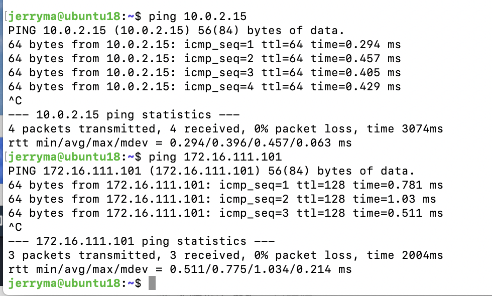

4. 靶机(victim)的所有对外上下行流量必须经过网关(gateway)

靶机访问www.zhihu.com时dnsmasq日志的记录：

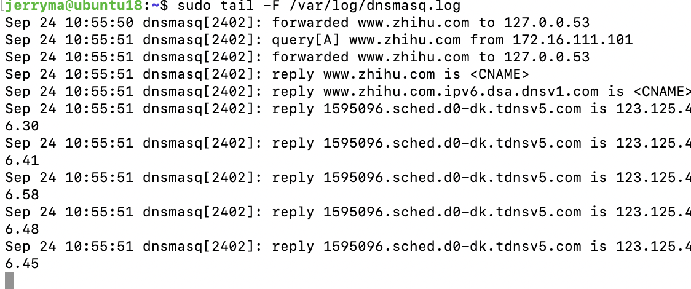

5. 所有节点均可以访问互联网

- 网关

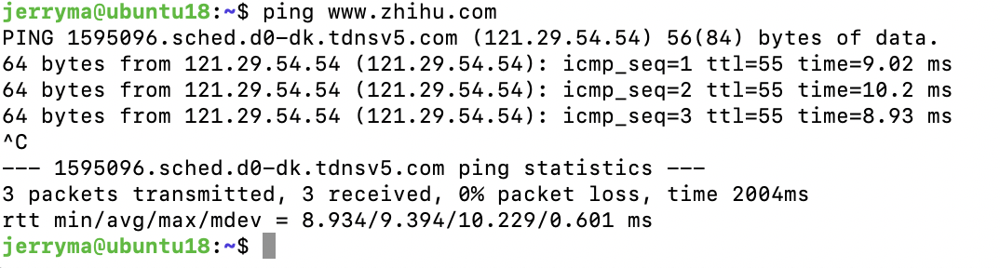

- 靶机

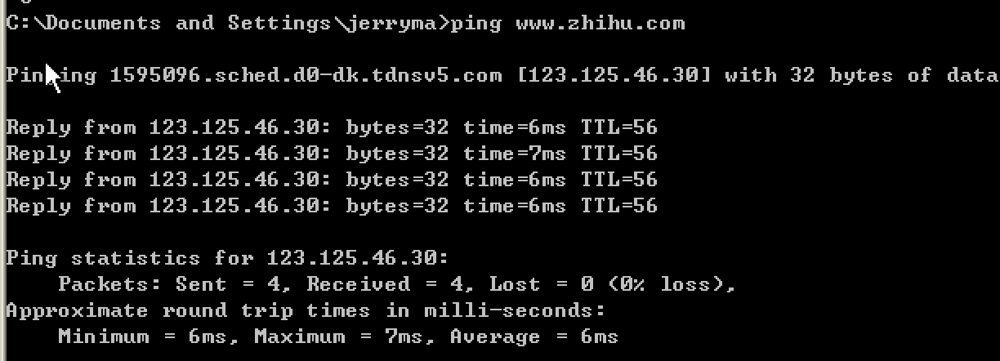

- 攻击者

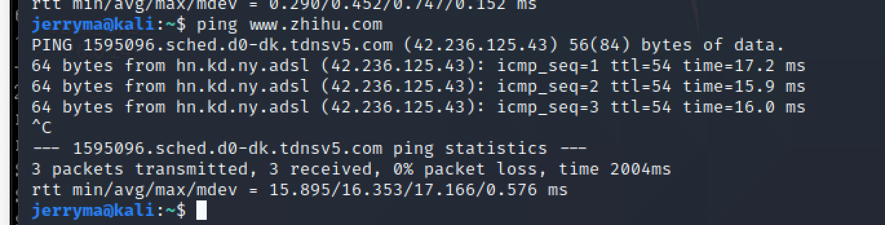

### 实验时遇到的问题

##### 虚拟机自身问题

- virtualbox for Mac 6.1安装kali等系统都无法启动，显示**异常退出**

- 转而使用parallels desktop，安装成功，但是设置网卡时，没有internal模式和NAT模式

继续解决

- 通过下载旧版本的virtualbox，解决。

##### victim、attacker与gateway都不能相互ping通

- 将vicitm网卡的控制芯片改为`PCnet-FAST III (Am79C973)`，并关闭windows-xp的防火墙

- Host-Only网络以DHCP方式动态获取ip地址,内部网络网卡intnet1手动分配ip地址

  - 修改/etc/network/interfaces
  - 重启网络`systemctl restart networking`


##### 宿主机和gateway无法建立ssh连接

- 错误修改了.yaml文件导致出现多个地址，连接了自己Mac的地址
- 删除添加的.yaml文件，找到正确的ip

##### 修改/etc/network/interfaces时命令行卡死，重启后网卡消失

- 使用命令
  - `sudo ifdown enp0s3&&sudo ifup enp0s3`
  - `sudo ifdown enp0s8&&sudo ifup enp0s8`
  - `sudo ifdown enp0s9&&sudo ifup enp0s9`

##### dns重启失败

编辑dnsmasq.conf后，执行`systemctl restart dnsmasq`一直报错，查看日志，显示`172.16.111.1 address already used`，结果等了几分钟，再次执行，就好了？？迷惑

## 参考资料

1. [virtualbox虚拟网络详解](https://c4pr1c3.github.io/cuc-wiki/courses/2014_2/VirtualboxNetwork.pdf)

2. [配置文件](https://gist.github.com/c4pr1c3/8d1a4550aa550fabcbfb33fad9718db1)

3. [课程视频](https://www.bilibili.com/video/BV16t4y1i7rz?p=12)

