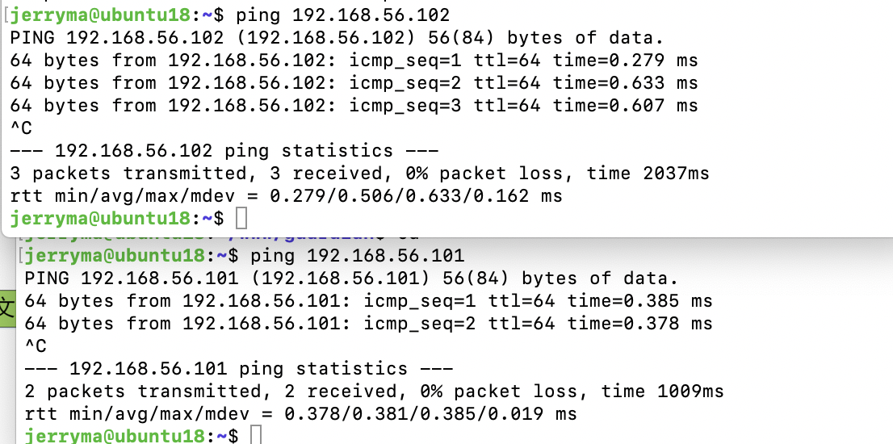
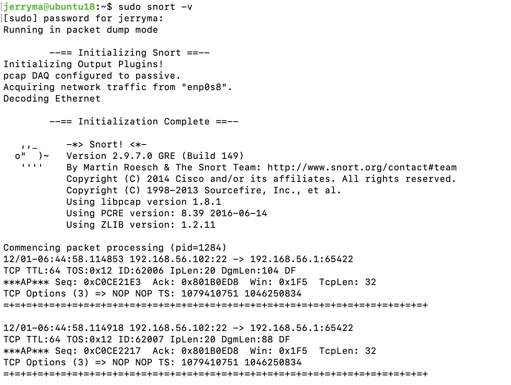
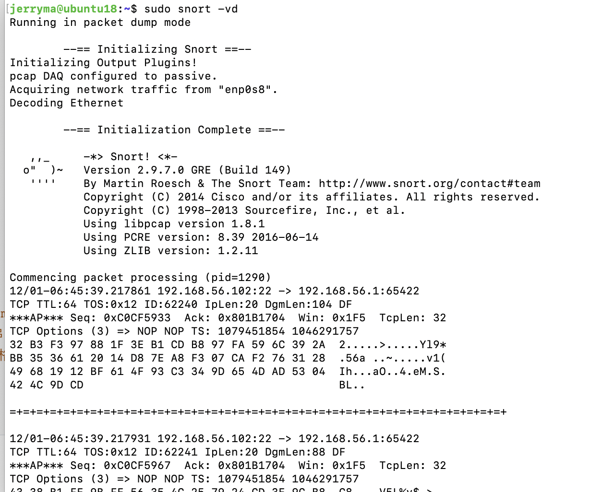
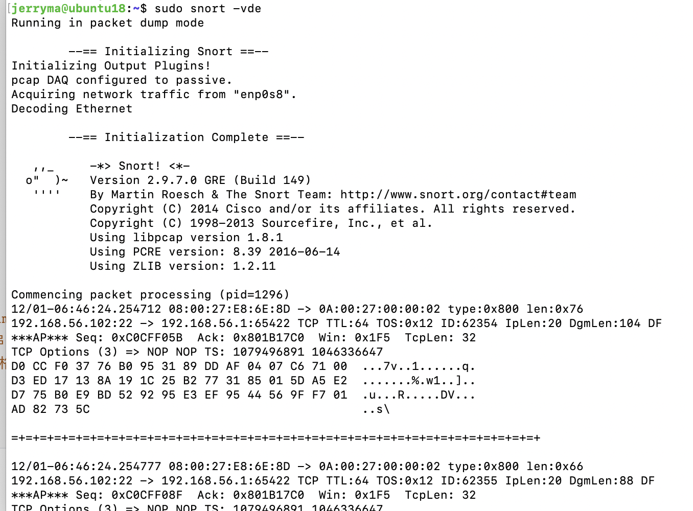
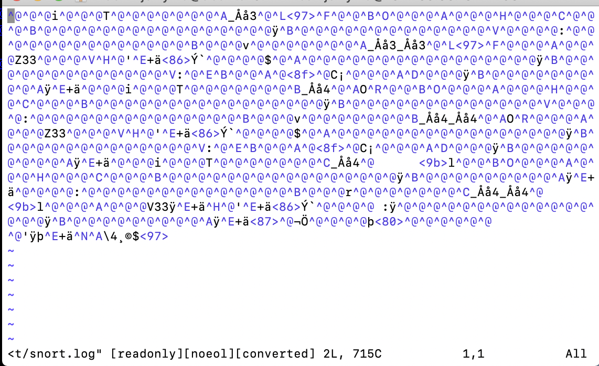
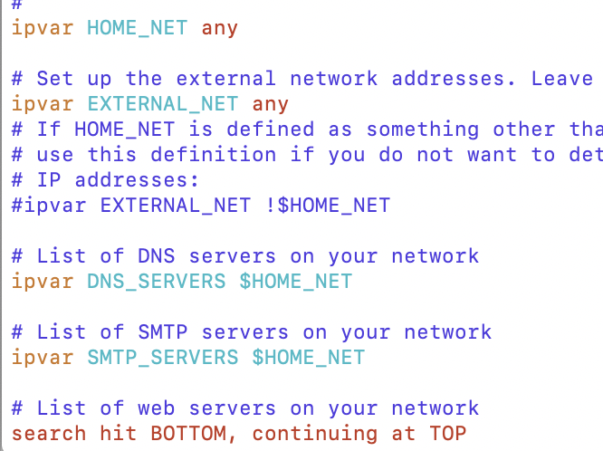
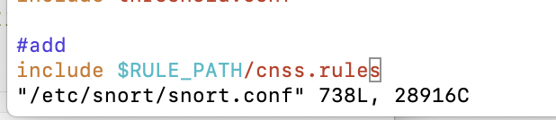
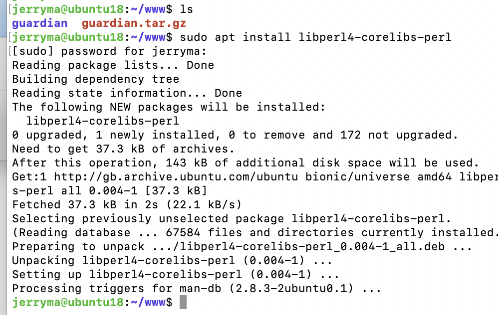
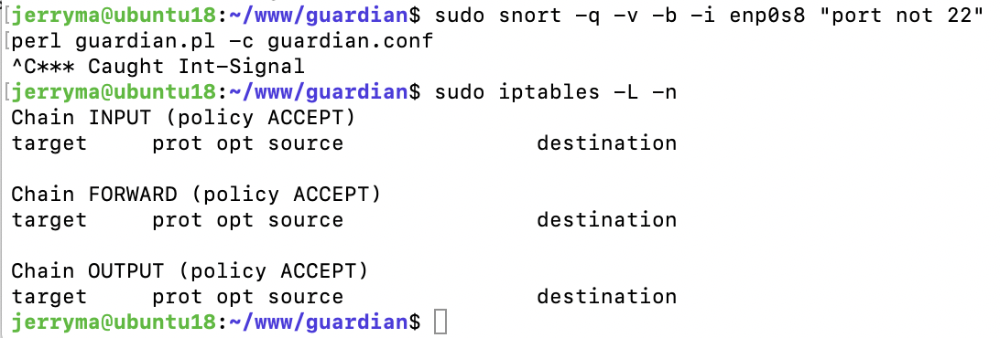
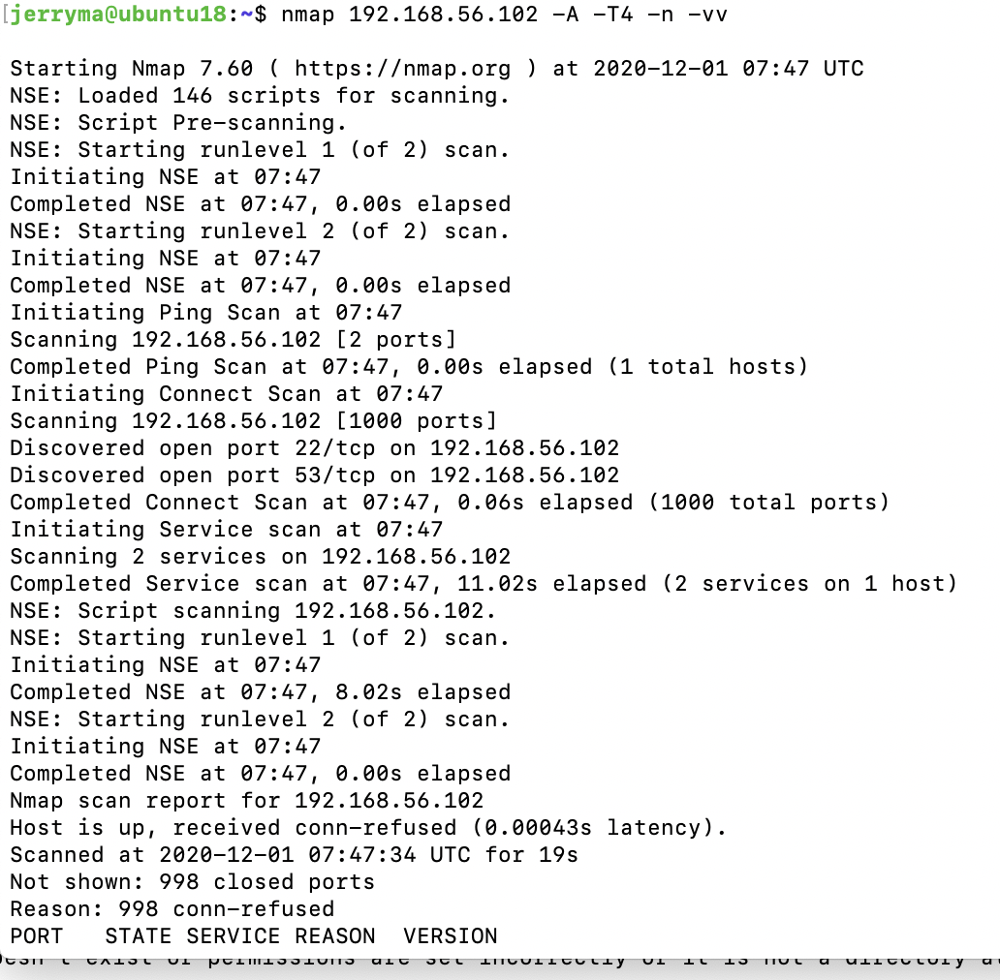

# chap0x09

## 实验内容

- [x] 实验一
- [x] 实验二
- [x] 实验三
- [ ] 实验四

## 环境配置

### 主机设置

- VM-1 运行 `nmap` 扫描 VM-1
- VM-2 运行 `snort` 和 `guardian.pl`

> 两台主机均为ubuntu18.04

#### 网络拓扑信息

| 主机 | 网卡1（host-only）enp0s8 |
| ---- | ------------------------ |
| VM-1 | 192.168.56.101(nmap)     |
| VM-2 | 192.168.56.102(snort)    |

>  VM-1 和 VM-2 可以互相双向访问。



## 实验过程

### 1. 准备

>  配置VM-2

#### snort(实验1～3)

- 安装

  ```shell
  # 禁止在apt安装时弹出交互式配置界面
  export DEBIAN_FRONTEND=noninteractive
  
  apt install snort
  ```

- 配置snort为嗅探模式

  ```shell
  # 显示IP/TCP/UDP/ICMP头
  snort –v
  
  # 显示应用层数据
  snort -vd
  
  # 显示数据链路层报文头
  snort -vde
  
  # -b 参数表示报文存储格式为 tcpdump 格式文件
  # -q 静默操作，不显示版本欢迎信息和初始化信息
  snort -q -v -b -i enp0s8 "port not 22"
  
  # 使用 CTRL-C 退出嗅探模式
  # 嗅探到的数据包会保存在 /var/log/snort/snort.log.<epoch timestamp>
  # 其中<epoch timestamp>为抓包开始时间的UNIX Epoch Time格式串
  # 可以通过命令 date -d @<epoch timestamp> 转换时间为人类可读格式
  # exampel: date -d @1511870195 转换时间为人类可读格式
  # 上述命令用tshark等价实现如下：
  tshark -i enp0s8 -f "port not 22" -w 1_tshark.pcap
  ```

  - 显示IP:TCP:UDP:ICMP头

  

  - 显示应用层数据

  

  - 显示数据链路层报文头

    

  - 查看数据包日志出现乱码

    

- 配置并启用snort内置规则

  ```shell
  # /etc/snort/snort.conf 中的 HOME_NET 和 EXTERNAL_NET 需要正确定义
  # 例如，学习实验目的，可以将上述两个变量值均设置为 any
  snort -q -A console -b -i enp0s8 -c /etc/snort/snort.conf -l /var/log/snort/
  ```

  

- 自定义snort规则

  ```shell
  # 新建自定义 snort 规则文件
  cat << EOF > /etc/snort/rules/cnss.rules
  alert tcp \$EXTERNAL_NET any -> \$HTTP_SERVERS 80 (msg:"Access Violation has been detected on /etc/passwd ";flags: A+; content:"/etc/passwd"; nocase;sid:1000001; rev:1;)
  alert tcp \$EXTERNAL_NET any -> \$HTTP_SERVERS 80 (msg:"Possible too many connections toward my http server"; threshold:type threshold, track by_src, count 100, seconds 2; classtype:attempted-dos; sid:1000002; rev:1;)
  EOF
  # 添加配置代码到 /etc/snort/snort.conf
  include $RULE_PATH/cnss.rules
  snort -q -A fast -b -i enp0s8 -c /etc/snort/snort.conf -l /var/log/snort/
  ```

  - 新建自定义 snort 规则文件

    - 执行命令

    

    - 成功

    

  - 添加配置代码

    

#### guardian.pl

解压缩 Guardian-1.7.tar.gz

`tar zxf guardian.tar.gz`

安装 Guardian 的依赖 lib

`apt install libperl4-corelibs-perl`



### 2. 和防火墙联动

在VM-2上先后开启 `snort` 和 `guardian.pl`

```bash
# 开启 snort
snort -q -A fast -b -i enp0s8 -c /etc/snort/snort.conf -l /var/log/snort/
# 假设 guardian.tar.gz 解压缩后文件均在 /root/guardian 下
cd /root/guardian
```

编辑 guardian.conf 并保存，确认以下2个参数的配置符合主机的实际环境参数。

```ini
HostIpAddr      192.168.56.102
Interface       enp0s8
# 启动 guardian.pl
perl guardian.pl -c guardian.conf
```

在VM-1上用 `nmap` 暴力扫描 VM-2：

```bash
nmap 192.168.56.102 -A -T4 -n -vv
```

guardian.conf 中默认的来源IP被屏蔽时间是 60 秒（屏蔽期间如果黑名单上的来源IP再次触发snort报警消息，则屏蔽时间会继续累加60秒）

```bash
root@KaliRolling:~/guardian# iptables -L -n
Chain INPUT (policy ACCEPT)
target     prot opt source               destination
REJECT     tcp  --  192.168.56.101       0.0.0.0/0            reject-with tcp-reset
DROP       all  --  192.168.56.101       0.0.0.0/0

Chain FORWARD (policy ACCEPT)
target     prot opt source               destination

Chain OUTPUT (policy ACCEPT)
target     prot opt source               destination

# 1分钟后，guardian.pl 会删除刚才添加的2条 iptables 规则
root@KaliRolling:~/guardian# iptables -L -n
Chain INPUT (policy ACCEPT)
target     prot opt source               destination

Chain FORWARD (policy ACCEPT)
target     prot opt source               destination

Chain OUTPUT (policy ACCEPT)
target     prot opt source               destination
```

## 遇到的问题

- VM-2启动snort和guardian.pl好像没成功？



- VM-1用nmap扫描结果是这样的

  

