#  基于 Scapy 编写端口扫描器

## 实验目的

- 掌握网络扫描之端口状态探测的基本原理

## 实验环境

- python + scapy

## 实验要求｜完成清单

- 禁止探测互联网上的 IP ，严格遵守网络安全相关法律法规
- 完成以下扫描技术的编程实现

  - [x] TCP connect scan / TCP stealth scan

  - [x] TCP Xmas scan / TCP fin scan / TCP null scan

  - [x] UDP scan
- 上述每种扫描技术的实现测试均需要测试端口状态为：`开放`、`关闭` 和 `过滤` 状态时的程序执行结果
- 提供每一次扫描测试的抓包结果并分析与课本中的扫描方法原理是否相符？如果不同，试分析原因；
- 在实验报告中详细说明实验网络环境拓扑、被测试 IP 的端口状态是如何模拟的
- （可选）复刻 `nmap` 的上述扫描技术实现的命令行参数开关

## 实验过程

### 实验环境说明

**网络环境拓扑**

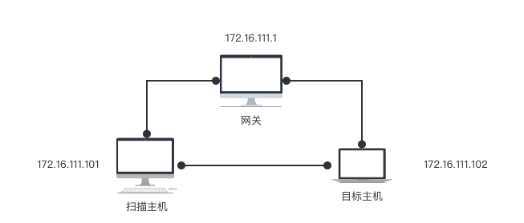

**被测试 IP 的端口状态如何模拟**

- 扫描主机

  使用Nmap扫描目标主机端口状态`nmap -Pn 172.16.111.102`

- 目标主机

  开启80/TCP端口`ufw allow 80/tcp`

  开启53/UDP端口`ufw allow 53/udp`
  
- 如何模拟filtered状态

  - 对80/tcp端口：开启Apache服务，将ufw中的相关规则删除

至此，准备的端口如下

| IP             | 端口   | 状态                 |
| -------------- | ------ | -------------------- |
| 172.16.111.102 | 53/UDP | open/closed/filtered |
| 172.16.111.102 | 80/TCP | open/closed/filtered |

- 以80/tcp端口为例

  - 端口开放

    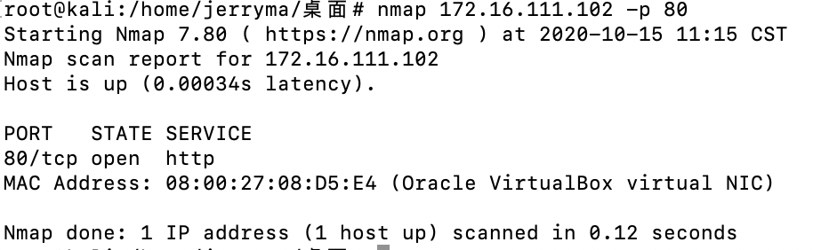

  - 端口关闭

    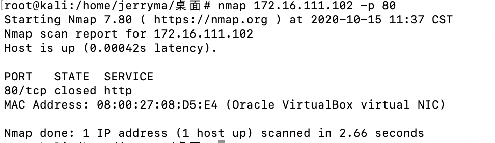

  - 端口过滤

    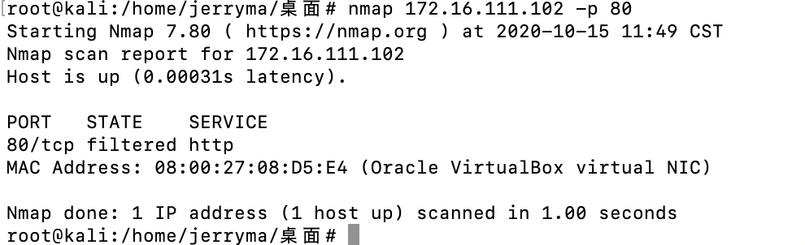

### 扫描技术的编程实现

#### TCP connect scan(nmap扫描：-sT)


- 端口状态为：`开放`、`关闭` 和 `过滤` 状态时的程序执行结果

  - 端口`开放`时
    - 程序执行结果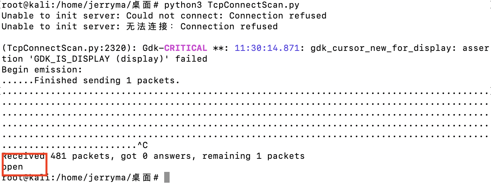
    - Wireshark抓包结果
      - 编程执行时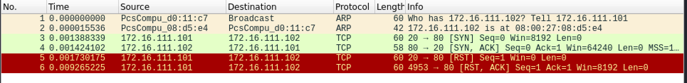
      - nmap扫描时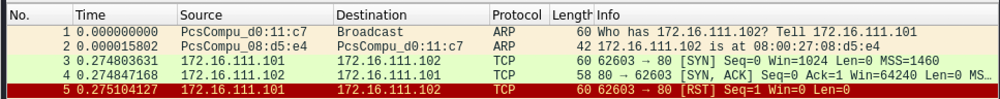
  - 端口`关闭`时
    - 程序执行结果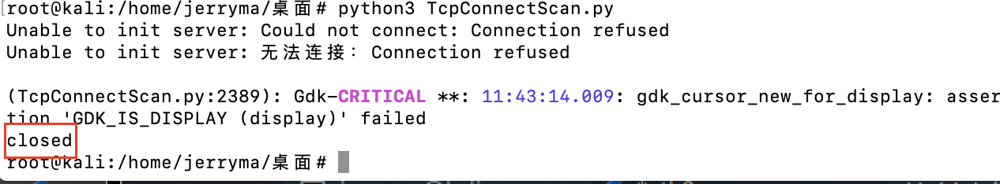
    - Wireshark抓包结果
      - 编程执行时
      - nmap扫描时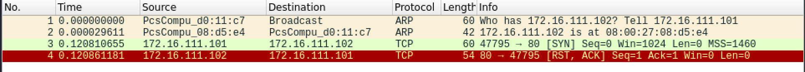
  - 端口`过滤`时
    - 程序执行结果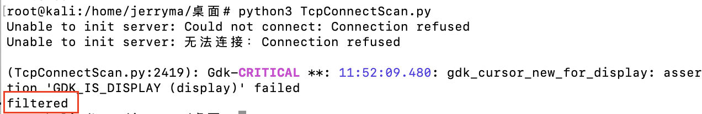
    - Wireshark抓包结果
      - 编程执行时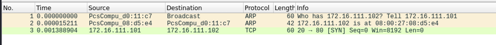
      - nmap扫描时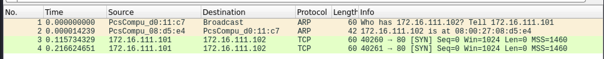

- 与课本中的扫描方法原理是否相符

  > 相符


#### TCP stealth scan(nmap扫描：-sS)


- 端口状态为：`开放`、`关闭` 和 `过滤` 状态时的程序执行结果

  - 端口`开放`时
    - 程序执行结果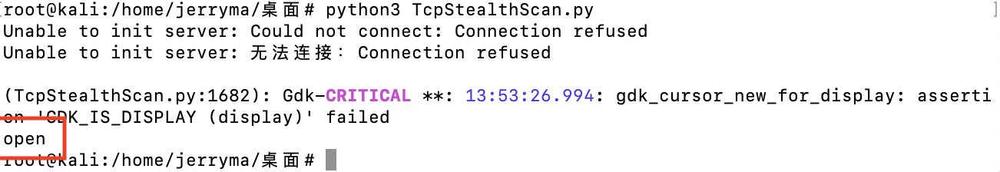
    - Wireshark抓包结果
      - 编程执行时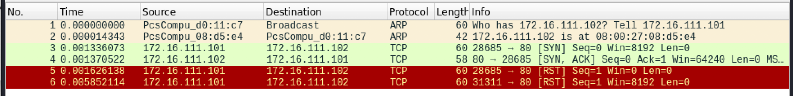
      - nmap扫描时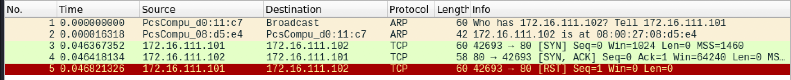
  - 端口`关闭`时
    - 程序执行结果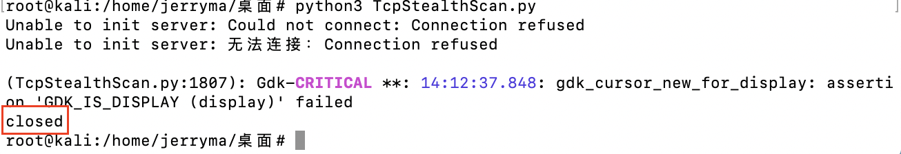
    - Wireshark抓包结果
      - 编程执行时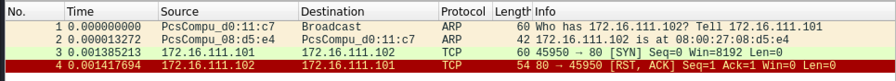
      - nmap扫描时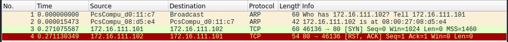
  - 端口`过滤`时
    - 程序执行结果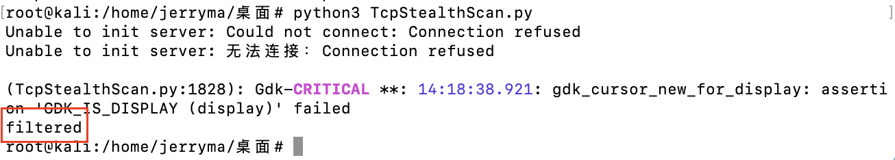
    - Wireshark抓包结果
      - 编程执行时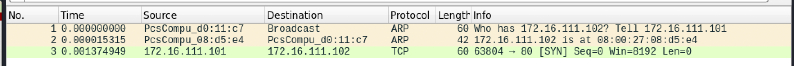
      - nmap扫描时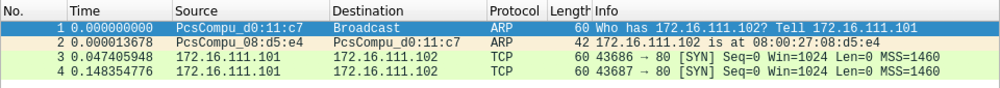

- 与课本中的扫描方法原理是否相符

  > 相符

#### TCP Xmas scan (nmap扫描：-sX)


- 端口状态为：`开放`、`关闭` 和 `过滤` 状态时的程序执行结果

  - - 端口`开放`时
      - 程序执行结果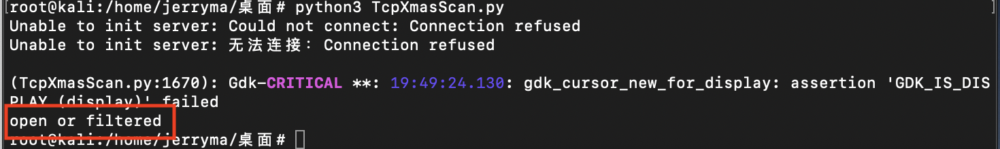
      - Wireshark抓包结果
        - 编程执行时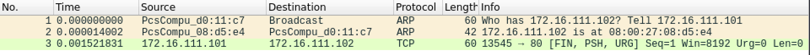
        - nmap扫描时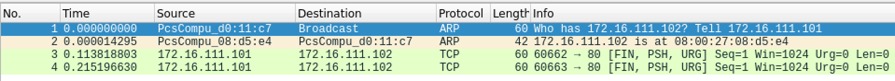
    - 端口`关闭`时
      - 程序执行结果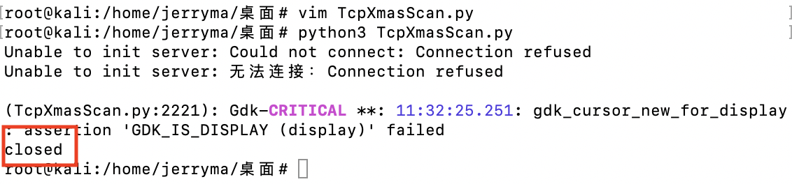
      - Wireshark抓包结果
        - 编程执行时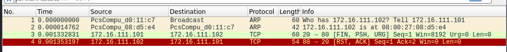
        - nmap扫描时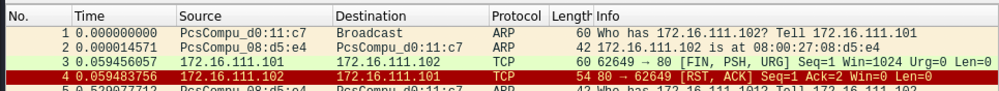
    - 端口`过滤`时
      - 程序执行结果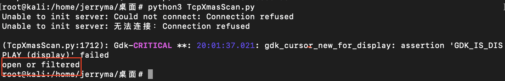
      - Wireshark抓包结果
        - 编程执行时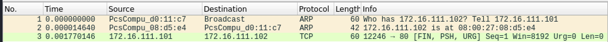
        - nmap扫描时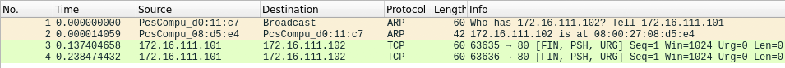
- 与课本中的扫描方法原理是否相符

> 相符

#### TCP fin scan (nmap扫描：-sF)


- 端口状态为：`开放`、`关闭` 和 `过滤` 状态时的程序执行结果

  - - 端口`开放`时
      - 程序执行结果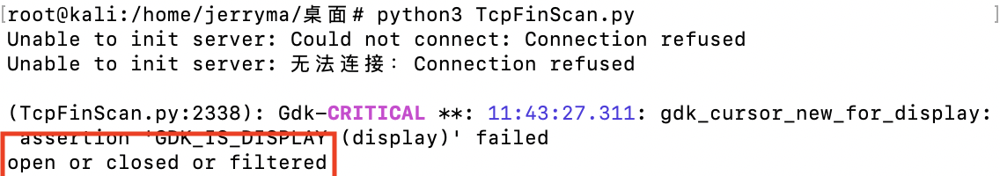
      - Wireshark抓包结果
        - 编程执行时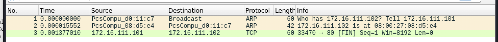
        - nmap扫描时
    - 端口`关闭`时
      - 程序执行结果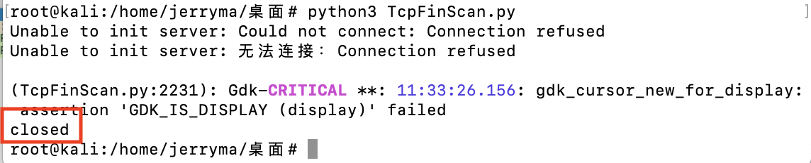
      - Wireshark抓包结果
        - 编程执行时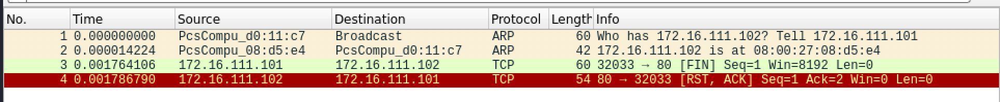
        - nmap扫描时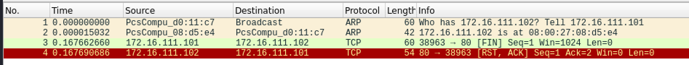
    - 端口`过滤`时
      - 程序执行结果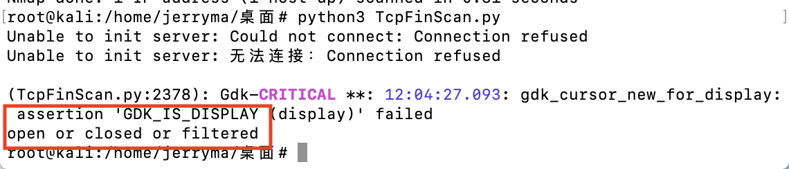
      - Wireshark抓包结果
        - 编程执行时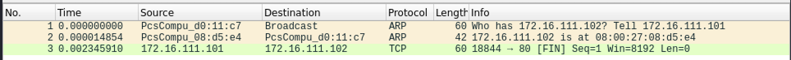
        - nmap扫描时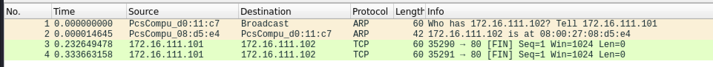
- 与课本中的扫描方法原理是否相符

> 相符

#### TCP null scan(nmap扫描：-sN)


- 端口状态为：`开放`、`关闭` 和 `过滤` 状态时的程序执行结果
  - 端口`开放`时

    - 程序执行结果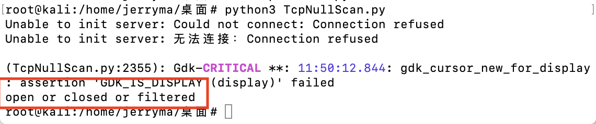

    - Wireshark抓包结果
      - 编程执行时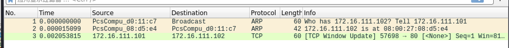
      - nmap扫描时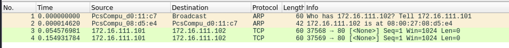

  - 端口`关闭`时

    - 程序执行结果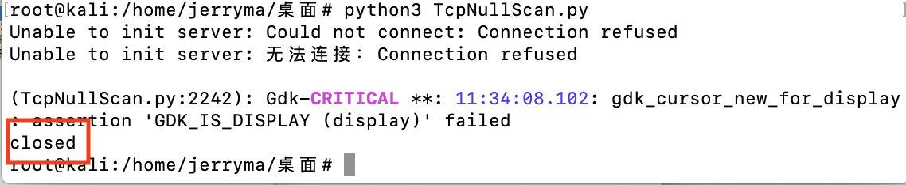

    - Wireshark抓包结果

      - 编程执行时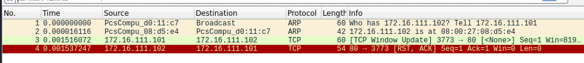

      - nmap扫描时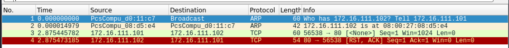

  - 端口`过滤`时

    - 程序执行结果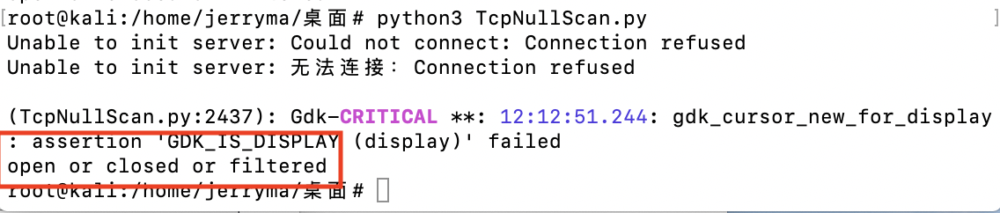

    - Wireshark抓包结果

      - 编程执行时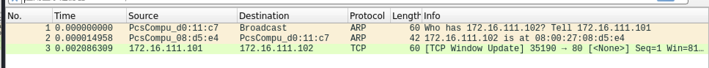

      - nmap扫描时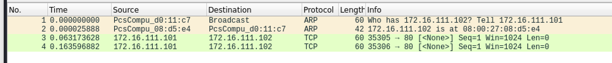

- 与课本中的扫描方法原理是否相符

> 相符

#### UDP scan(nmap扫描：-sU)


- 端口状态为：`开放`、`关闭` 和 `过滤` 状态时的程序执行结果

  - 端口`开放`或`过滤`时
    - 程序执行结果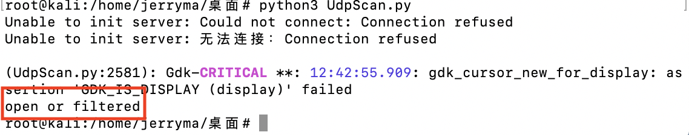
    - Wireshark抓包结果
      - 编程执行时
      - nmap扫描时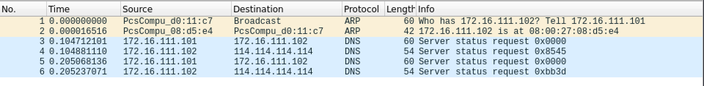
  - 端口`关闭`时
    - 程序执行结果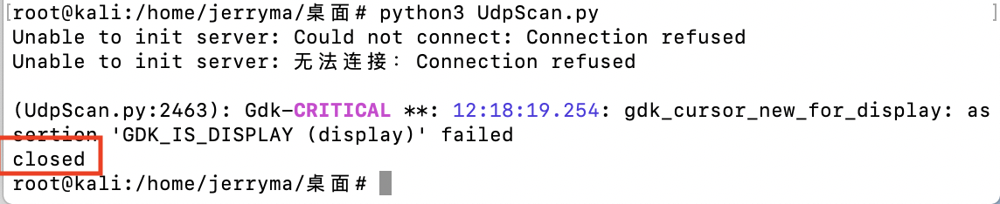
    - Wireshark抓包结果
      - 编程执行时
      - nmap扫描时
- 与课本中的扫描方法原理是否相符

> 不相符，课本中的扫描方法是发送「UDP」包，而nmap -sU发送的是「DNS」包，并且当没有收到ICMP的不可达回应时，nmap -sU会多次发送DNS包

## 实验中遇到的问题

1. 目标主机开启80/TCP端口无效

- 目标主机

  开放80/TCP端口`ufw allow 80/tcp`

  查看80端口已开启(查看规则，显示行号)`ufw status numbered`

  

- 扫描主机

  使用Nmap查看目标主机80/TCP端口，显示**closed**

  

**解决方法**

- 目标主机

  开启Apache服务`service apache2 start`

- 扫描主机

  查看目标主机80/TCP端口，显示**open**

  

2. 目标主机开启22/UDP端口无效

   目标主机已开启ssh服务但`nmap -sU -p 22 172.16.111.102`显示22/UDP为**closed**

   原因：ufw防火墙只控制端口是否可达，没有服务使用udp也没有监听，ssh的22端口是tcp，所以无法开启udp监听。

**解决方法**

开启53/UDP端口

使用dnsmasq搭建dns服务并开启服务`service dnsmasq start`

此时用zenmap进行扫描，确定53/UDP开启


3. update无法解析域名

**解决方法**

在/etc/resolv.conf中添加如下内容

```
nameserver 8.8.8.8
nameserver 8.8.4.4
```

执行`sudo /etc/init.d/networking restart`

4. 扫描主机在执行`nmap -T4 -A -v --unprivileged 172.16.111.102`时提示

   ```shell
   You requested a scan type which requires root privileges.
   QUITTING!
   ```

**解决方法**

使用**root**权限执行

5. TCP Xmas Scan在端口关闭时扫描显示open｜filtered（编程结果与nmap一致）

**解决方法**

将防火墙关闭`ufw disable`

> 不关闭防火墙，使用nmap -p 80 172.16.111.102对端口进行扫描，显示的是closed，为什么？
>
> 老师的解答：
>
> 1. 不同的扫描方法有不同的应用场景，ACK扫描主要用于判断目标端口是否被过滤，SYN扫描适合于判断目标端口是否开启或关闭。
>
> 2. 为了准确判定目标端口的状态，我们通常会使用多种扫描方法。关闭的状态从主机视角是确定的，一定要注意，我们的网络扫描是远程去「推断」，推断的状态是有对有错的。
> 3. 如果是两种不同方式的『扫描』，得到不同的状态结果很正常。网络扫描不是一个『确定性』方法，网络协议是一个「状态机」，不同输入会产生不同的响应状态。一个开放/关闭/被过滤的端口，对于不同的输入按照协议设计和实现，自然会有不同的预定义响应方法。同一种协议设计，也会有不同的协议实现，这些也会导致不同协议栈实现的服务器即使收到相同的packet，也会回应不同的 packet。
>

## 参考文献

[2018-NS-Public-jckling](https://github.com/CUCCS/2018-NS-Public-jckling)

[课件](https://c4pr1c3.github.io/cuc-ns/chap0x05/main.html)

[Linux kali开启端口、关闭防火墙方法](https://blog.csdn.net/qq_42103479/article/details/90111365?utm_medium=distribute.pc_aggpage_search_result.none-task-blog-2~all~first_rank_v2~rank_v25-3-90111365.nonecase&utm_term=kali开启关闭端口&spm=1000.2123.3001.4430)

[Kali2020版本zenmap安装教程](https://blog.csdn.net/qq_40201827/article/details/105205468)

