# 常见蜜罐体验和探索

## 实验目的

* 了解蜜罐的分类和基本原理
* 了解不同类型蜜罐的适用场合
* 掌握常见蜜罐的搭建和使用

## 实验环境

* 从 [paralax/awesome-honeypots](https://github.com/paralax/awesome-honeypots) 中选择 1 种低交互蜜罐和 1 种中等交互蜜罐进行搭建实验
    * 推荐 `SSH` 蜜罐

## 实验要求

- [x] 记录蜜罐的详细搭建过程；
- [x] 使用 `nmap` 扫描搭建好的蜜罐并分析扫描结果，同时分析「 `nmap` 扫描期间」蜜罐上记录得到的信息；
- [x] 如何辨别当前目标是一个「蜜罐」？以自己搭建的蜜罐为例进行说明；
- [ ] （可选）总结常见的蜜罐识别和检测方法；
- [ ] （可选）基于 [canarytokens](https://github.com/thinkst/canarytokens) 搭建蜜信实验环境进行自由探索型实验；

## 实验过程

### 网络配置

- **蜜罐**

系统：ssh-honeypotd、cowrie使用kali，kippo使用CentOS7，hornet使用ubuntu16.04

网络：

			1. 内部网络(kali：172.16.111.103，CentOS7：172.16.111.104)
   			2. host-only((kali：192.168.57.11，CentOS7：192.168.57.20)

- **攻击者**

系统：kali

网络：

1. 内部网络(172.16.111.131)
2. host-only(192.168.57.11)

- 网关

系统：ubuntu18.04

网络：

1. 内部网络(172.16.111.1)
2. NAT网络(10.0.2.15)

### 低交互蜜罐

> [ssh-honeypotd](https://github.com/sjinks/ssh-honeypotd) - C 编写的低交互 SSH 蜜罐

#### 搭建

- 修改`/etc/ssh/sshd_config`

  ```shell
  Port=222 # 将22端口留给蜜罐使用,本机连接kali使用222端口
  ```

- 安装docker

```shell
$ sudo apt-get update
$ sudo apt-get install \
    apt-transport-https \
    ca-certificates \
    curl \
    gnupg-agent \
    software-properties-common
$ curl -fsSL https://download.docker.com/linux/debian/gpg | sudo apt-key add -
$ sudo apt-key fingerprint 0EBFCD88
# 在 /etc/apt/sources.list 中添加 Docker 官方的 apt 镜像源地址：
if [[ $(grep -c "docker.com" /etc/apt/sources.list) -eq 0 ]];then echo "deb https://download.docker.com/linux/debian buster stable" >> /etc/apt/sources.list;fi
$ sudo apt-get update
$ sudo apt-get install docker-ce docker-ce-cli containerd.io
$ sudo docker run hello-world
```

- 搭建蜜罐环境

```shell
git clone https://github.com/sjinks/ssh-honeypotd # 克隆仓库
cd ssh-honeypotd # 进入文件夹
docker build . -t local:ssh-honeypotd # 构建镜像
# 运行镜像
docker run -d \
    --network=host \
    --cap-add=NET_ADMIN \
    --restart=always \
    --read-only \
    --name=ssh-honeypotd \
    -e ADDRESS=0.0.0.0 \
    -e PORT=22 \
    wildwildangel/ssh-honeypotd:latest
```

- 查看容器ID`docker ps`

```shell
CONTAINER ID        IMAGE                                COMMAND                  CREATED             STATUS              PORTS               NAMES
e3b170add83f        wildwildangel/ssh-honeypotd:latest   "/entrypoint.sh -k /…"   12 minutes ago      Up 12 minutes                           ssh-honeypotd
```

#### nmap扫描

在攻击者主机上使用几种不同nmap扫描方法扫描蜜罐

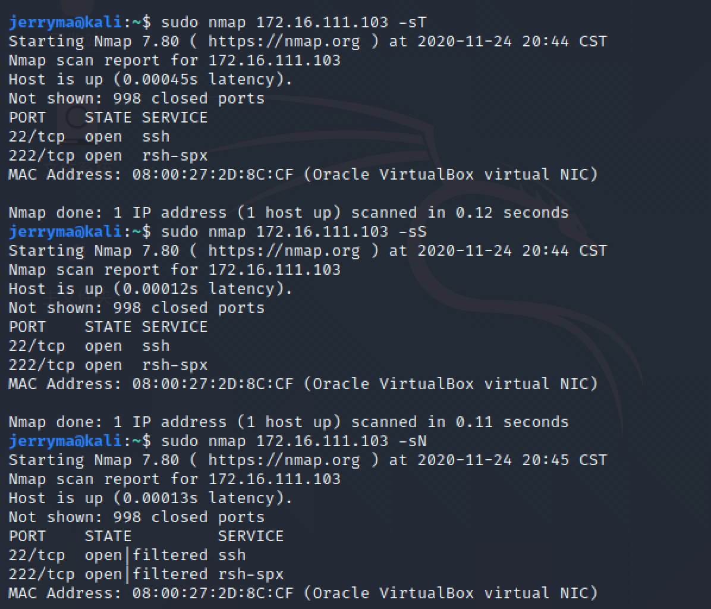

在蜜罐宿主机上查看日志`sudo docker logs e3b170add83f`


可以发现事件已经被记录下来了：`Did not receive identification string from 172.16.111.131:xxx (target: 172.16.111.103:22)`

但是不清楚第三个记录里为什么ip地址和端口会是**?:-1**

#### 如何辨别

在上一步的nmap扫描中，可以看到扫描显示服务名称为**rsh-spx**

查询端口对应的服务，发现正确

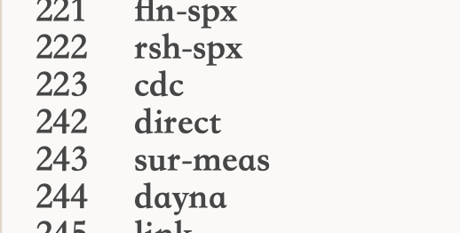

攻击者尝试使用ssh连接蜜罐

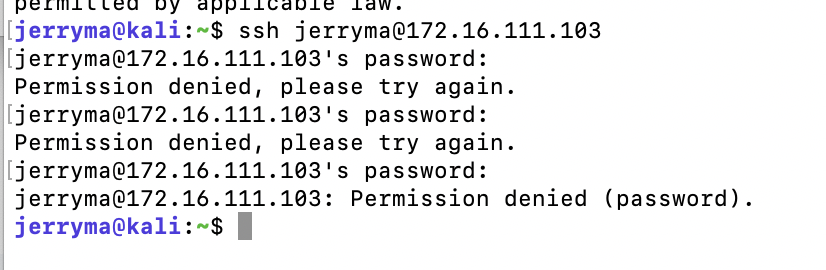

> 即使输入正确的密码也无法登入

在蜜罐上查看日志，发现登录过程已经被记录，包括了**ip地址、端口号、使用的密码**

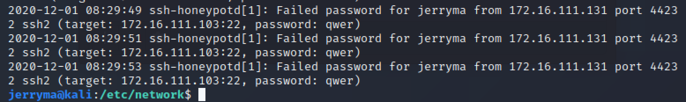

- 所以这个蜜罐只能记录 ssh 连接测试，甚至都连接不上，感觉是个被“焊死”了的蜜罐......

### 中等交互蜜罐

> [Kippo](https://github.com/desaster/kippo) - 中交互 SSH 蜜罐

#### 搭建

> 一开始本来打算在kali里搭一个centos7镜像，在里面运行kippo，结果pull centos实在太慢了，于是新建了一个虚拟机安装精简版的centos7（使用的镜像文件：CentOS-7-x86_64-Minimal-2009.iso）。

- 安装环境（root）

```shell
yum install libffi libffi-devel gcc git -y
yum install python-devel openssl openssl-devel -y
yum install python-twisted-core python-setuptools python-virtualenv -y
easy_install pycrypto pyasn1 
easy_install pip
pip install cryptography
sudo pip install twisted==15.2.0
sudo pip install service_identity
```

- 修改ssh端口并关闭防火墙（root）

```shell
vi /etc/ssh/sshd_config # 修改 Port 为 222
systemctl stop firewalld.service
```

- 创建用户并克隆项目（root）

```shell
useradd -d /kippo kippo # 新建一个kippo账号
echo "kippo    ALL=(ALL)       ALL" >> /etc/sudoers #将kippo添加进sudoers文件
# 登录用户kippo
sudo git clone https://github.com/desaster/kippo.git # 下载kippo
cd kippo
cp kippo.cfg.dist kippo.cfg
./start.sh
```

- 启动成功

  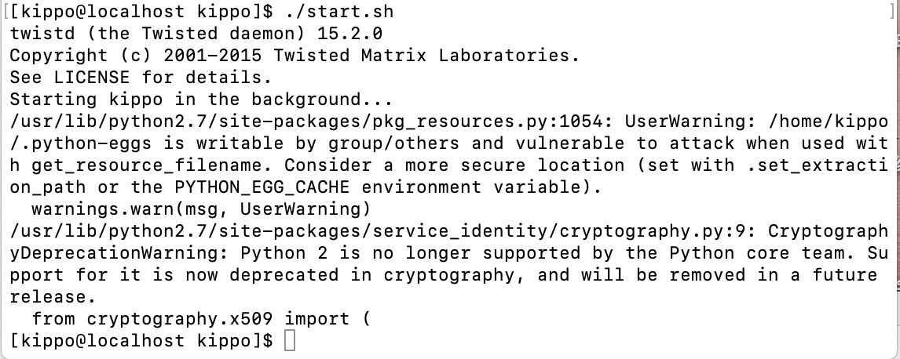

  - 启动时遇到的问题

    1. 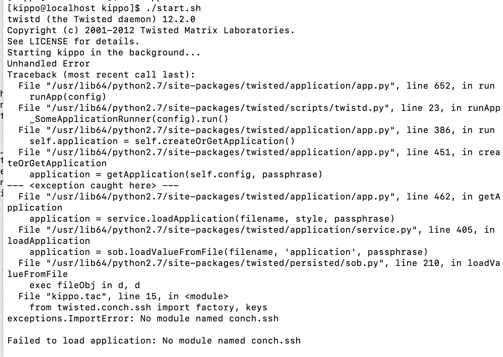

    - 解决：更新pip，重新执行`sudo pip install twisted==15.2.0`，这里走了很多弯路，第一遍执行的时候看以为安装成功了，然后搜索报错，看[这篇博客](http://blog.chinaunix.net/uid-20262041-id-3015312.html)走了很多弯路，最后发现....

    2. 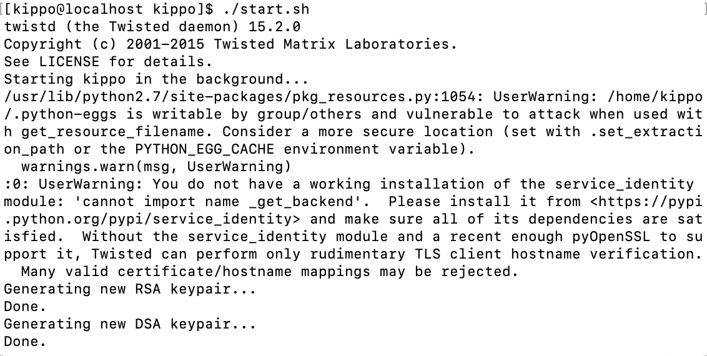

    - 解决：强制更新包` sudo pip install --ignore-installed service_identity `

#### nmap扫描

对蜜罐进行扫描，没有在蜜罐上找到对应的日志记录扫描行为


#### 如何辨别

搭建成功之后我尝试用攻击者对蜜罐进行ssh连接，但是一直出现报错

`Received disconnect from 172.16.111.104 port 2222:3: couldn't match all kex parts`

`Disconnected from 172.16.111.104 port 2222`

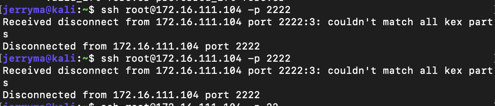

改端口为22，222依旧连不上

在蜜罐主机上查看端口

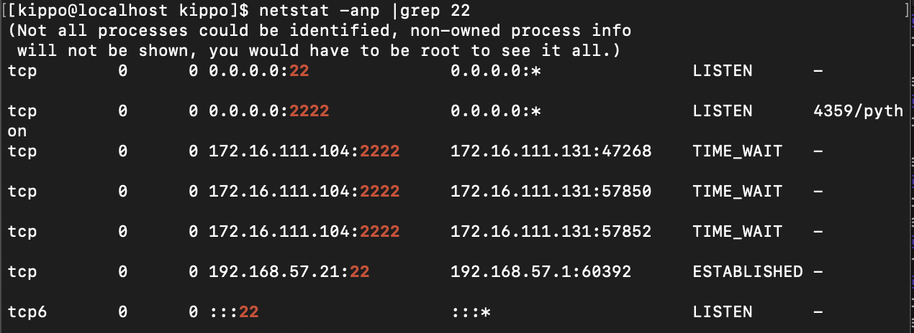

关闭kippo后进行ssh连接，显示拒绝连接

换成在kali的docker里构建centos7，结果还是出问题。

然后看了[这篇文章](https://github.com/desaster/kippo/issues/194)，我决定还是耗子尾汁，换个🍯不要自讨苦吃......

**总结：kippo有关的安装文章太少了，一直在搭建时踩坑。**

> [cowrie ](https://github.com/cowrie/cowrie) - Cowrie SSH 蜜罐 (基于 kippo)

#### 搭建

```shell
docker pull cowrie/cowrie # 拉取镜像
docker run -p 2222:2222 cowrie/cowrie # 运行镜像
```

#### nmap扫描

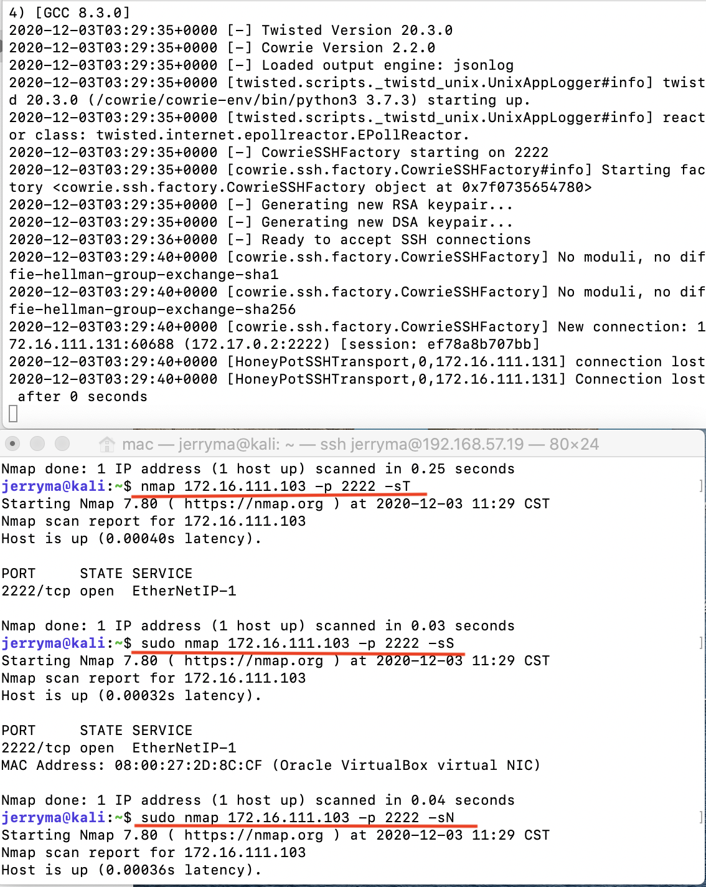

对蜜罐进行nmap扫描，发现只有TCP connect scan在蜜罐中留下了记录，TCP stealth scan和 TCP null scan都没有记录。

#### 如何辨别

在攻击者主机上执行`ssh root@172.16.111.103 -p 2222`，随便输入一个密码登录蜜罐，执行一些命令如`ip a`,`ifconfig`,`apt update`,`apt-get update`

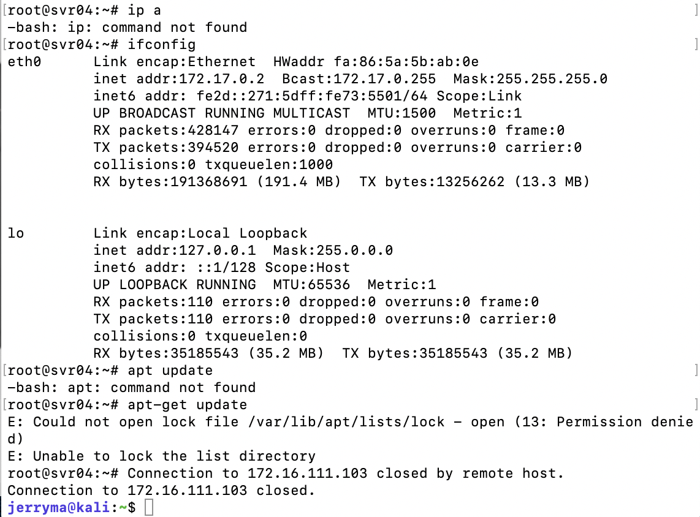

发现`ifconfig`显示的ip竟然没有登录用的`172.16.111.103`

而且作为“root”用户在update时显示`permission denie`

当然这些操作都在蜜罐中被记录下来了

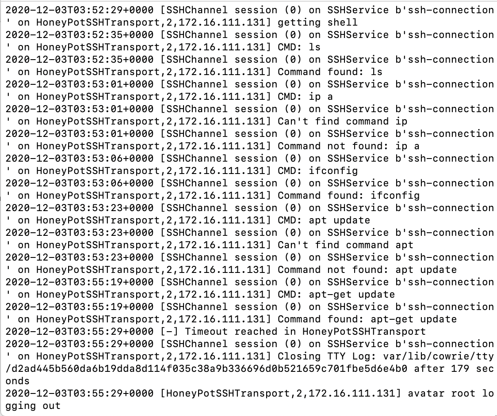

> [hornet](https://github.com/czardoz/hornet) - 支持多虚拟主机的中交互 SSH 蜜罐

用docker构建镜像时报错

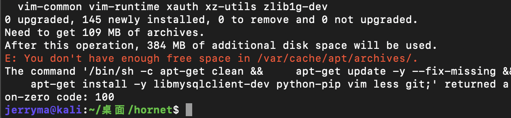

用ubuntu18.04搭建后执行`hornet -v`显示找不到该命令

根据Dokerfile，用ubuntu16.04搭建，执行`hornet -v`后在文件夹中看到了说明中相应的文件

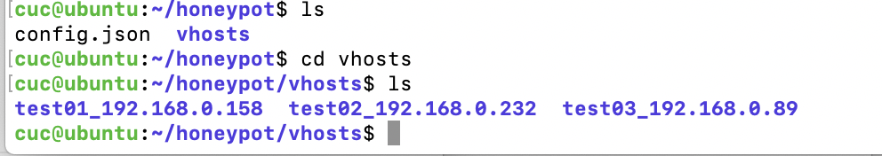

然而在此执行又有报错了

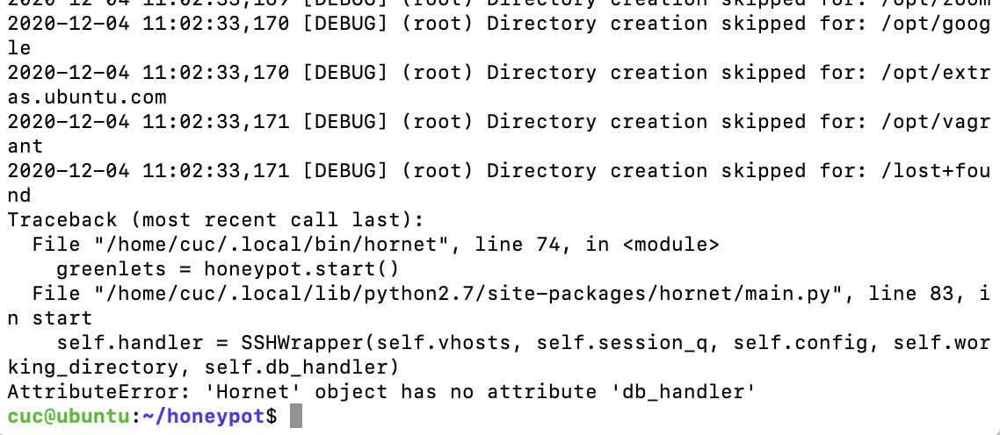

希望作者还记得自己的GitHub账号，更新一下......

## 实验总结

本次实验测试了五个蜜罐，但实际上只有两个实验成功了，分别是ssh-honeypotd和cowrie。

ssh-honeypotd只能欺骗攻击者连接ssh并记录连接行为，但不能让攻击者真正登录，在实际的攻击中只能吸引攻击者“试图打开蜜罐”，然而没有入口，这就像一个实心的蜜罐。

cowrie功能则更为丰富，攻击者可以轻而易举的进入蜜罐，但是稍微有点经验的攻击应该都能看出来这是一个蜜罐，因为它还是缺少很多常见功能，连update都有问题（连我这样的新手连上了一个主机第一反应都是update），因此很容易被发现。

基于以上两个蜜罐都很容易发现问题，我又测试了kippo和hornet，但是由于kippo年久失修（大概？）搭建的时候一直各种报错，hornet的dockerfile也有问题，导致都没搭完整，还浪费了很多时间。

在docker里搭了一半canarytokens之后kali直接开始无限登录，估计是内存不够了.....下次一定

## 参考文献

[ssh-honeypotd](https://github.com/sjinks/ssh-honeypotd)

[Kippo](https://github.com/desaster/kippo)

https://www.linuxprobe.com/centos7-install-kippo.html

http://blog.chinaunix.net/uid-20262041-id-3015312.html

https://segmentfault.com/a/1190000020671797?utm_source=tag-newest

https://github.com/cowrie/cowrie

https://github.com/czardoz/hornet